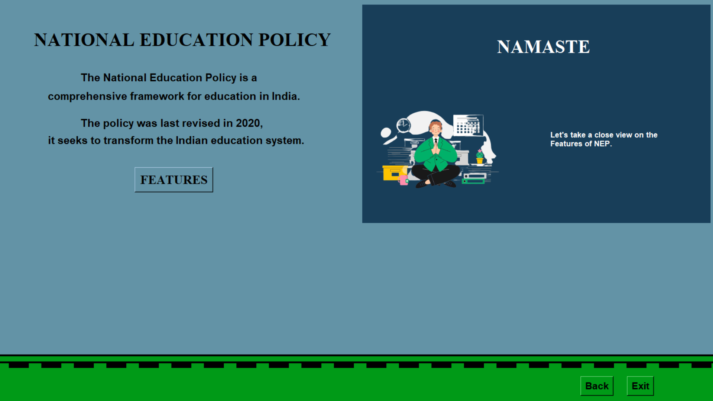
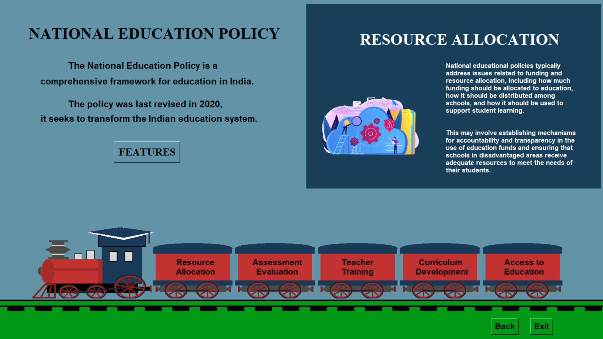

# Python Poster - National Education Policy

An interactive **Tkinter + Pillow** application showcasing the **National Education Policy (NEP)** with animations, graphics, and interactive panels.

---

## 📸 Screenshots





---

## ⚡ Features

- Fullscreen Tkinter UI with splash screen
- Animated canvas graphics
- Interactive **Splash Page** and **Poster Page**
- Buttons for exploring NEP features
- Organized assets in `/assets` folder

---

## 📂 Project Structure

```
├── assets/ # Images, Video
│   ├── access_edu_1.png
│   ├── chakra1.png
│   ├── curriculum_1.png
│   ├── emblem3.png
│   ├── evaluation_1.png
│   ├── namaste_2.png
│   ├── Pyhton Sem2 Output.mp4
│   ├── resource_1.png
│   ├── splash.gif
│   ├── teacher_1.png
│   ├── tricolor.png
│   ├── welcome_1.png
├── .gitignore
├── homepage.py
├── main.py
├── poster.py
├── README.md
├── requirements.txt
├── setup.bat
└── setup.sh
```

---

## 🚀 Installation & Running

### 1️⃣ Clone the repository

```bash
git clone https://github.com/NirajPujari/Python-Poster
cd Python-Poster
```

### 2️⃣ Install dependencies

```bash
pip install -r requirements.txt
```

### 3️⃣ Run the App

- Window
  ```bash
  ./setup.bat
  ```
- Linux
  ```bash
  chmod +x setup.sh
  ./setup.sh
  ```
- Manually
  ```bash
  # Window
  python main.py
  ```
  ```bash
  #Linux
  python3 main.py
  ```

## 🛠 Requirements

- Python 3.8+
- tkinter (comes pre-installed with Python)
- Pillow for image handling

## 🙌 Credits

Developed as a demonstration project for National Education Policy (NEP) visualization using Python Tkinter.
Major Credits to Mukti Shah and [Akshay Nair](https://github.com/Akshay-Nair2005/Akshay-Nair2005)
